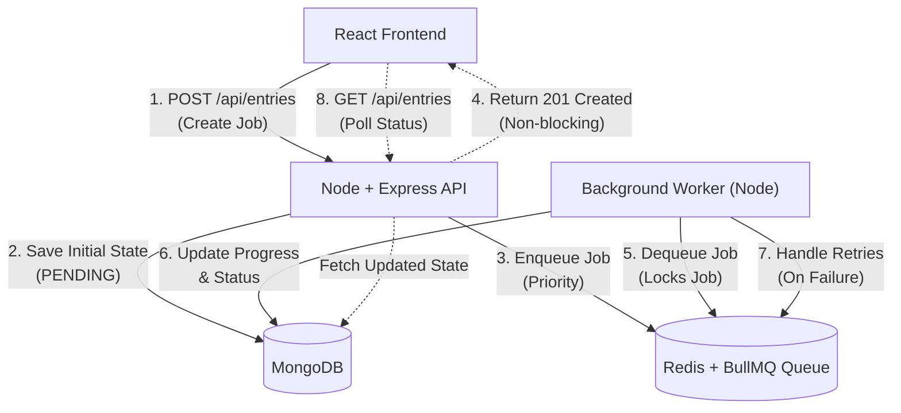

# Async Task Processing System

<div align="center">
  
  
  
  
  
  
</div>

<br />

A robust and scalable full-stack application that demonstrates **asynchronous background job processing** with real-time status tracking. This project employs a decoupled, queue-driven worker architecture to guarantee fault tolerance, extreme concurrency, and horizontal scalability.

---

## Key Features

### Core Operations
- **Create Background Jobs:** Offload heavy lifting to background processes via an asynchronous API.
- **Priority-Based Processing:** Strictly respects job priorities (`HIGH` > `MEDIUM` > `LOW`).
- **Real-Time Tracking:** Frontend polls and automatically updates job progress and status seamlessly.
- **Final Result Storage:** Persists processing output to the database.
- **Failure Handling & Retries:** Automatic retries for simulated errors (e.g., maximum 3 attempts) coupled with exponential backoff strategy.

### Concurrency & Scalability
- **BullMQ Job Locking:** Ensures comprehensive idempotency. Jobs are locked and processed exclusively by one worker to avoid duplicate executions.
- **MongoDB Atomic Updates:** Enforces robust job state lifecycle transitions.
- **Highly Decoupled:** The API purely delegates to the Queue and never processes a job, making it completely non-blocking.
- **Fault-Tolerant:** API server downtime or restarts do not impact or abort actively processing asynchronous jobs.

---

## High-Level Architecture

The system segregates API routing, Queue orchestration, and Worker execution to maximize throughput and isolation.



1. **API Server:** Receives creation requests, persists the `PENDING` job into MongoDB, orchestrates the job payload into BullMQ, and immediately responds to the client. Maintains zero execution overhead.
2. **Queue Layer (Redis & BullMQ):** Maintains job queues, strictly orders execution based on `HIGH`/`LOW` priority mapping, ensures atomic single-worker distribution locking, and dictates automated retry/backoff parameters.
3. **Worker Node:** A completely isolated background process that queries Redis for work, updates progress states directly to MongoDB (`PROCESSING` to `COMPLETED`), and simulates realistic failure/retry flows gracefully.

---

## Setup & Execution 

### Prerequisites
- **Node.js** (v18+ recommended)
- **MongoDB** (Local instance or MongoDB Atlas)
- **Redis** (Local instance or Upstash)

### 1. Environment Variables Configuration
Navigate to the `server/` directory and configure the `.env` file with your credentials:

```env
PORT=5000
MONGODB_URI=your_mongodb_connection_string
REDIS_URL=your_redis_connection_string
```

### 2. Start the API Server
The API Server handles frontend routes and delegates tasks to the message broker.

```bash
cd server
npm install
npm run dev
```

### 3. Start the Dedicated Worker Process
Open a **new, entirely separate terminal window**. This proves architectural segregation.

```bash
cd server
npm run worker
```

### 4. Start the React Frontend
Open a **third terminal window**.

```bash
cd client
npm install
npm run dev
```
Navigate to: `http://localhost:5173`

---

## API Documentation

The lightweight RESTful API interfaces purely for state transition dispatchment and state retrieval.

| Endpoint | Method | Description |
| :--- | :---: | :--- |
| `/api/entries` | `POST` | Safely creates a brand new asynchronous task and delegates it to the queue. |
| `/api/entries` | `GET` | Fetches a list of all past and current processing jobs alongside their statuses. |
| `/api/entries/:id` | `GET` | Retrieves real-time granularity status and completion metrics of a solitary job. |

---

## Demo Scenarios (Testing the Architecture)

**1. Priority Routing Test**
- Create 3 `LOW` priority jobs simultaneously, and immediately spawn a `HIGH` priority job.
- *Expected Output:* The independent Worker intercepts the `HIGH` job queue strictly before resuming iteration overhead of all preceding `LOW` jobs. 

**2. Simulation of Cascading Failures**
- Spin up jobs normally. The backend simulates a pseudo-random fail-rate (roughly 20%).
- *Expected Output:* BullMQ will automatically pause operations relative to the failed task, impose exponential backoff, and autonomously resurrect the task upwards of 3 total attempts until forced rejection to `FAILED`.

**3. API Restart Fortitude Test**
- Orchestrate a task. While it transitions to `PROCESSING`, execute `Ctrl+C` in the Node API Server terminal.
- *Expected Output:* The UI updates halt, but the decoupled Worker process completely finishes the operation organically. Upon Node Server revival, the UI retrieves the validated `COMPLETED` record seamlessly, proving genuine fault tolerance.
